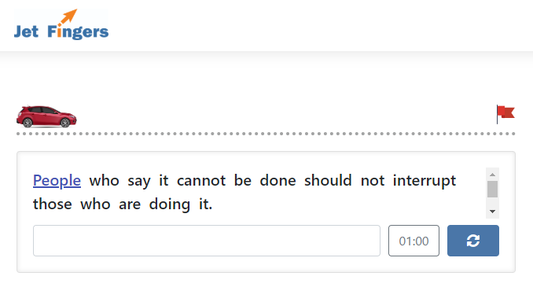

<p align="center">
  <br>
  One-minute Typing Speedtest
</p>

## Purpose
By playing the game you automatically improve your overall typing speed.  

## How it looks | [View the demo](http://cgraph.manas.edu.kg/)


## Setup
```
git clone https://github.com/azattix/JetFingers.git
cd JetFingers
```
### Install packages via node.js
```
npm i
```
### Or download it manually
##### Client-side
- [```Bootstrap ^4.3.1```](https://getbootstrap.com/)
- [```JQuery ^3.4.1```](https://jquery.com/)<br>
## Requirements for server
- ```PHP ^7.0```

## Acknowledgements
- A big thank you to Askar Duishenaliev for logo design

## Author
- Azamat Soodaev

## Lisence
This project is open source and available under the ISC lisence